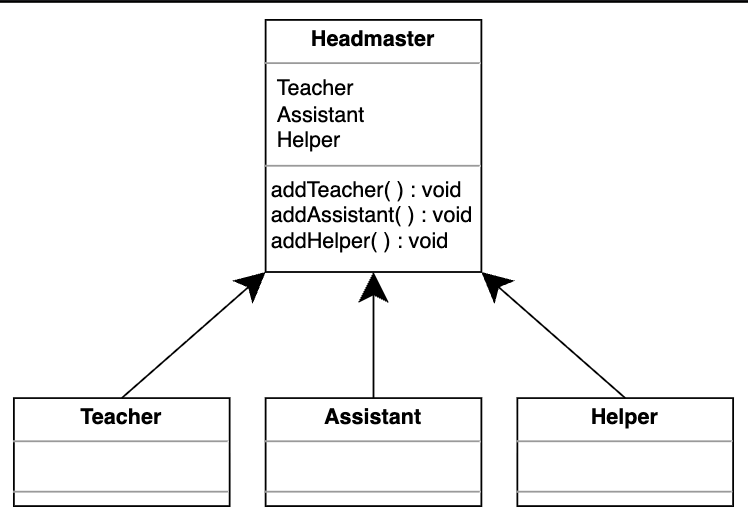
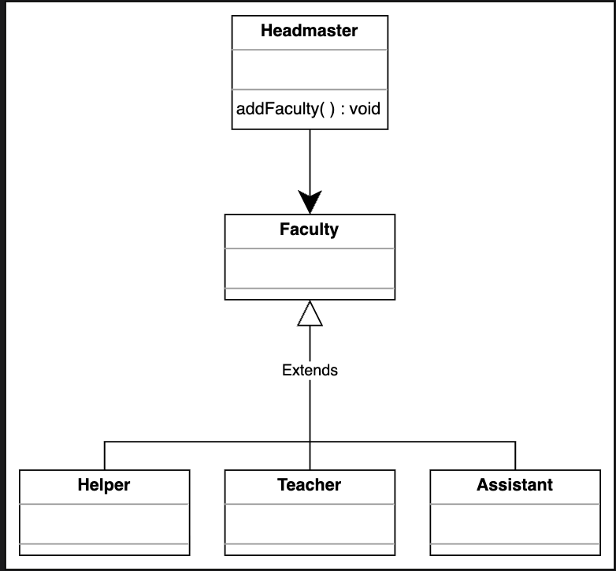
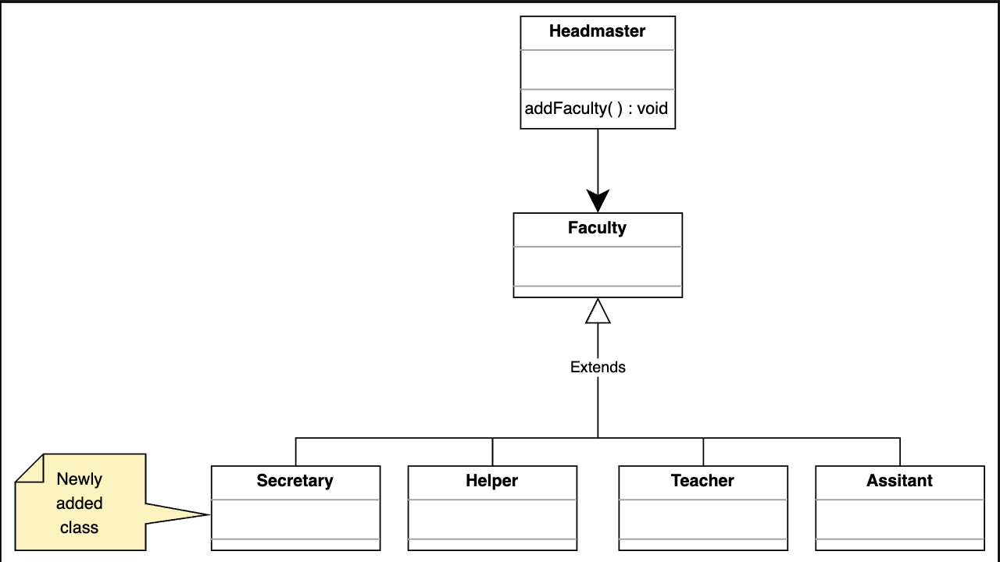

# SOLID: Dependency Inversion Principle
Get familiar with the concept of the Dependency Inversion Principle and its example.

### Introduction
The `Dependency Inversion Principle (DIP)` states that high-level modules should not depend on low-level modules, but rather both should depend on abstractions. The abstractions should not depend on details. Instead, the details should depend on abstractions.

In many cases, thinking about the interaction between modules as an abstract concept allows the linking of components to be reduced without the need for more coding patterns to be implemented. This allows for a functional scheme with reduced implementation and allows the system to be more flexible.

### Real-life example
Let’s try to understand the concept of DIP with the help of a school example. Suppose there is a headmaster of a high school. Under the headmaster, there are faculty members such as teachers, assistants, and some helpers.

### Violation
Let’s see what a possible design would look like without the implementation of the DIP.

The class diagram of this example is shown below:

Let’s note down some issues with this design:

* Everything is exposed from the lower layer to the upper layer, meaning that abstraction has not been implemented. This indicates that the headmaster must know the type of faculty that they can oversee beforehand.  
* Now, if an additional type of faculty comes under the headmaster, such as a secretary, then the entire system would need to be reconfigured.  

### Solution
A possible fix to this issue would be to add a `Faculty` class that will be the parent class for all types of faculty. This would reduce the number of dependencies among modules and would make for an easily expandable system.

Now, if any other kind of faculty is employed, they can just be easily added to the `Headmaster` without the need to explicitly inform the `headmaster` of it. Let’s take the example of an additional `faculty` position, `Secretary`. Its class would be a child of the `Faculty` class and would lead to the following diagram:

With this implementation, we have decoupled some of the modules, and therefore, satisfied the Dependency Inversion Principle.

### Conclusion
The DIP reduces the number of dependencies among modules. It provides a layer of abstraction between lower and higher classes, allowing for changes in the lower class without making changes in the higher class. A few benefits of the DIP are as follows:

* It allows for the flexibility and stability of the software.  
* It allows for the reusability of the application modules.