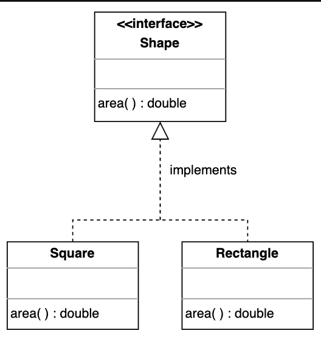
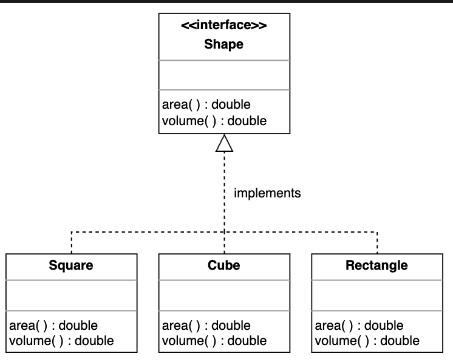
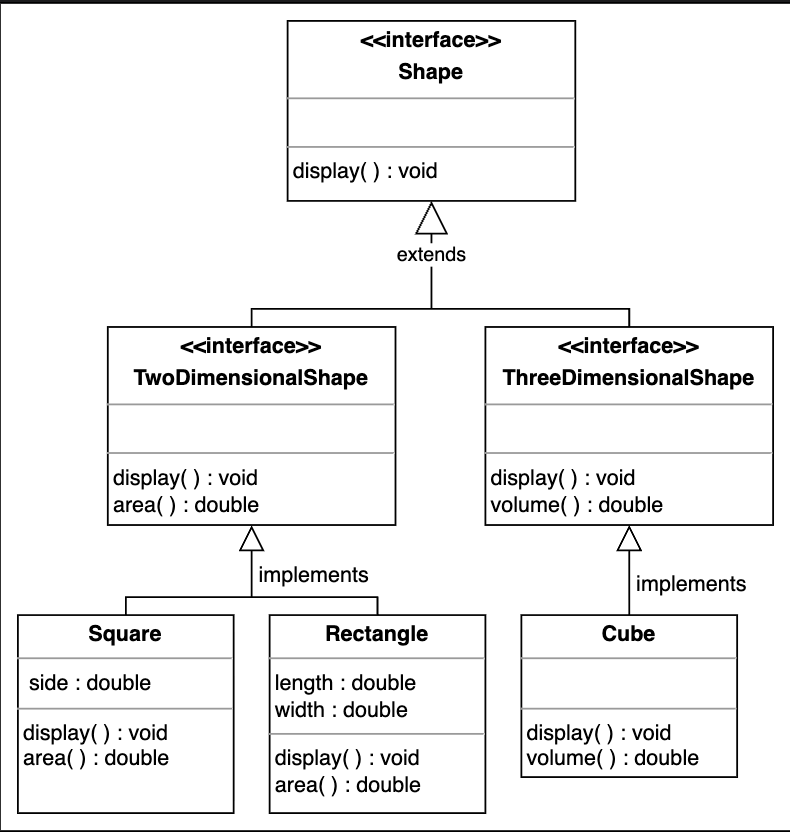

# SOLID: Interface Segregation Principle
Get introduced to the Interface Segregation Principle.

## Introduction
The **Interface Segregation Principle (ISP)** is a design principle that does not recommend having methods that an interface would not use and require. Therefore, it goes against having fat interfaces in classes and prefers having small interfaces with a group of methods, each serving a particular purpose.

The goal behind implementing the ISP is to have a precise code design that follows the correct abstraction guidelines and tends to be more flexible, which would help in making it more robust and reusable. This becomes key when more and more features are added to the software, making it bloated and harder to maintain.

Example
Let’s construct a simple interface called Shape that has the `area()` method, and `Square` and `Rectangle` as the classes to implement it as shown below:

So far, this implementation seems right, as both the `Square` and `Rectangle` classes are implementing an interface that they’re using. Let’s see how this example can violate the ISP.  

## Violation
Let’s add the `volume()` method to the `Shape` interface and have a new subclass `Cube` to implement it:

The violation leads to a problem. The 2-D shapes cannot have a volume, yet they’re forced to implement the `volume()` method of the `Shape` interface that they don’t have any use of. This is a clear violation of the Interface Segregation Principle.

Solution
To adhere to the Interface Segregation Principle (ISP), it is essential to ensure that an interface is client-specific rather than general-purpose. In this context, the solution involves implementing the Shape interface into two distinct interfaces: `TwoDimensionalShape` for 2D shapes and `ThreeDimensionalShape` for 3D shapes.

By organizing interfaces based on the dimensions of shapes, we avoid forcing 2D shape implementations to provide methods irrelevant to them. The separation follows the Interface Segregation Principle, resulting in a cleaner and more intuitive design. Classes representing 2D shapes only need to implement `TwoDimensionalShape`, while 3D shapes like `Cube` implement `ThreeDimensionalShape`, requiring the implementation of the `volume()` method appropriate to their nature.

### Conclusion
The ISP, being an important principle, is the most violated principle in object-oriented programming. This can easily be achieved by adding more features to our software, requiring us to update large parts of our program. A few benefits of the ISP are as follows:

* It helps to keep our software maintainable and robust.  
* It allows for efficient refactoring and redeployment of code.

