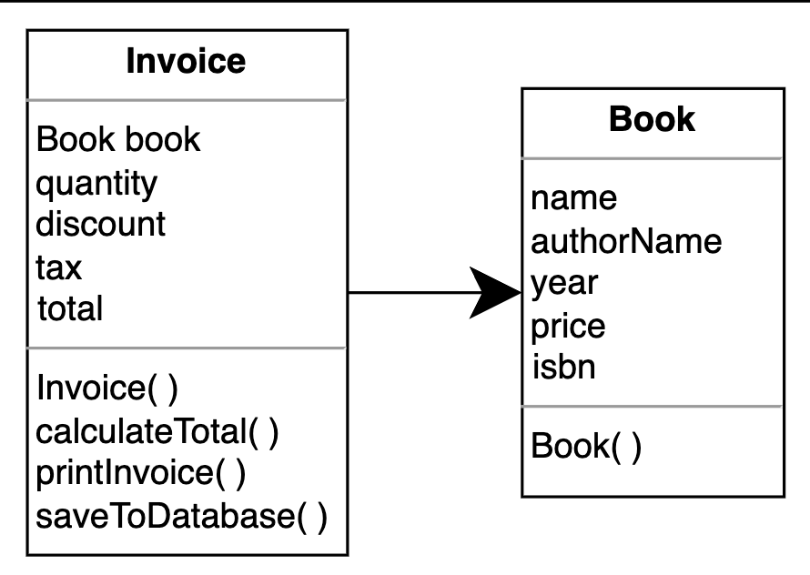
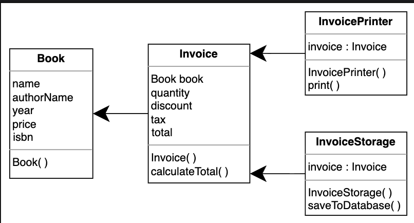

# SOLID: Single Responsibility Principle
Get familiar with the Single Responsibility principle along with its examples.

## Introduction
The Single Responsibility principle (SRP) is perhaps the least understood SOLID concepts. Robert C. Martin coined the term and defines it as follows: “A class should have only one reason to change.” This implies that any class or component in our code should only have one functionality. Everything in the class should be related to just one goal.

When programmers need to add features or new behavior, they frequently integrate everything within the current class. When something needs to be changed later, due to the complexity of the code, the update process becomes extremely time-consuming and tedious. The Single Responsibility Principle helps us create simple classes that perform just one task. This makes making modifications or adding extensions to the existing code much easier.

### Book invoice application
Let’s try to understand SRP with the help of an example. We have a book invoice application that has two classes: Book and Invoice. The Book class contains the data members related to the book. Whereas, the Invoice class contains the following three functionalities:

Calculating the price of the book.  
Printing the invoice.  
Saving the invoice into the database.

### Violations
If we notice, the `Invoice` class violates the SRP in multiple ways:

* The `Invoice` class is about invoices, but we have added print and storage functionality inside it. This breaks the SRP rule, which states, “A class should have only one reason to change.  

If we want to change the logic of the printing or storage functionality in the future, we would need to change the class.

Instead of modifying the `Invoice` class for these uses, we can create two new classes for printing and persistence logic: `InvoicePrinter` and `InvoiceStorage`, and move the methods accordingly, as shown below.

### Conclusion
When a class performs one task, it contains a small number of methods and member variables that are self-explanatory. SRP achieves this goal, and due to this, our classes are more usable, and they provide easier maintenance.
